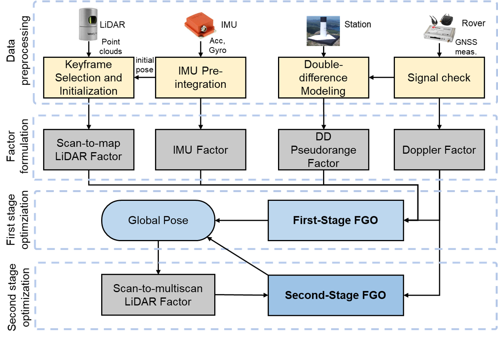
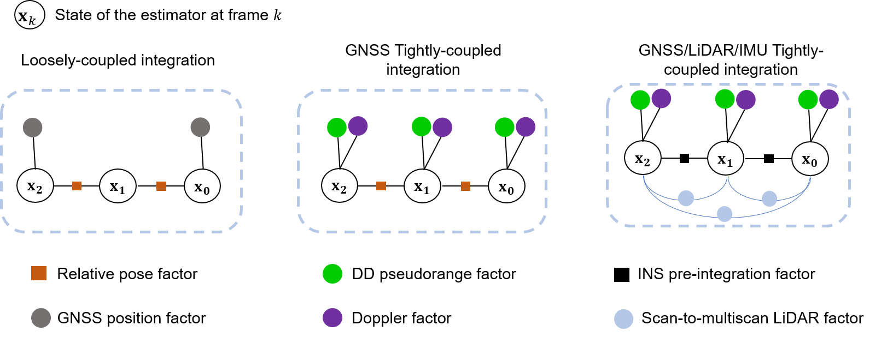

# 3DLA-GLIO

<p align='center'>
    
</p>

**GLIO: Tightly-Coupled GNSS/LiDAR/IMU Integration for Continuous and Drift-free State Estimation of Intelligent Vehicles in Urban Areas.** [paper link](./support_files/GLIO_paper.pdf)

**GLIO** is an accurate and robust online GNSS/LiDAR/IMU odometry system that tightly fuses the raw measurements from GNSS (pseudorange and Doppler), LiDAR, and IMU through non-linear factor graph optimization (FGO), which enables globally continuous and drift-free pose estimation even in highly challenging environments like urban canyons. 

The package is based on C++ which is compatible with the robot operation system (ROS) platform. Meanwhile, this package combines the RTKLIB (**[version: 2.4.3 b33](http://www.rtklib.com/)**) to read/decode the GNSS [RINEX](https://en.wikipedia.org/wiki/RINEX) files. Users from the Robotics field can easily have access to GNSS raw data for further study.

**Authors**: [Xikun Liu](https://www.polyu.edu.hk/aae/ipn-lab/us/index.html), [Weisong Wen](https://weisongwen.github.io/), [Li-ta Hsu](https://www.polyu.edu.hk/aae/ipn-lab/us/index.html) from the [Intelligent Positioning and Navigation Laboratory](https://www.polyu.edu.hk/aae/ipn-lab/us/index.html), The Hong Kong Polytechnic University.

**Contact**: Technical issue: [xi-kun.liu@connect.polyu.hk](xi-kun.liu@connect.polyu.hk), commercial issue: [welson.wen@polyu.edu.hk](welson.wen@polyu.edu.hk).

## System pipeline

<p align='center'>
    
</p>

We propose a system that utilizes two stages of the optimization to achieve global consistent and continuous pose estimation in real-time.
  - In the first stage of optimization-the *optimizeSlidingWindow* stage, the sliding-window-based FGO is employed to integrate the GNSS-related factors, IMU pre-integration factor, and scan-to-map-based LiDAR factor for efficient odometry estimation.
  - In the second stage of optimization-the *optimizeBatch* stage, the LiDAR factor is employed as a scan-to-multiscan scheme to maintain global consistency and improve the robustness to the GNSS outlier by large-scale batch optimization.

[//]: # (**Video:**)

[//]: # ()
[//]: # ([![GLIO Video]&#40;http://.jpg&#41;]&#40;https://www.youtube.com/ "GLIO Video"&#41;)

**Package feature:**

<p align='center'>
    
</p>

In this package, different fusion strategies for GNSS/LIO integration are implemented for comparison and further development, including
- The pose graph-based loosely-coupled GNSS/LIO integration
- The tightly-coupled GNSS/LIO integration with relative pose constraints
- The tightly-coupled GNSS/LiDAR/IMU integration with scan-to-multiscan LiDAR feature constraints.

The trajectories of different fusion methods are shown as figure below.

<p align='center'>
    
</p>

To enable and visualize different fusion results, following parameters need to be noted.

- ```visualization/LCinLocal```: Set true for activation and visualization of loosely-coupled GNSS/LIO fusion in ENU frame.
- ```Estimator/enable_batch_fusion```: Set true for activation and visualization of tightly-coupled batch-based GNSS/LiDAR/IMU integration in ENU frame.
- ```Estimator/sms_fusion_level```: Types of scan-to-multiscan constraints in batch-based integration. Set 0 for relative pose constraints, 1 for LiDAR surf feature constraints.

## GLIO with Docker
Build image
```bash
mkdir GLIO_ws/src
cd ~/GLIO_ws/src
git clone https://github.com/XikunLiu-huskit/GLIO.git
cd ./GLIO/docker
sudo make build #sudo if you get permission denied
```

It may take a while to build the image as we also build ceres. Once it finishes, start a container with:
```bash
sudo ./start_GLIO.sh #sudo if you get permission denied
```
It will also creat a dataset folder under /docker, which we can use as a shared folder between host and container. Download dataset in /dataset folder, then we can play GLIO with the data.

## Prerequisites
### 1 **Ubuntu** and **ROS**
Ubuntu 64-bit 18.04, ROS Melodic. [ROS Installation](http://wiki.ros.org/ROS/Installation). The package is tested on Ubuntu 18.04 with ROS Melodic. 

### 2. **Ceres Solver** and **GTSAM**
[Ceres Solver](https://ceres-solver.googlesource.com/ceres-solver) and [GTSAM](https://gtsam.org/) are used for optimization and fusion, for the installation of Ceres-solver, please refer to the instructions on [GraphGNSSLib](https://github.com/weisongwen/GraphGNSSLib). 

### 3. **Eigen**
[Eigen 3.3.3](https://gitlab.com/libeigen/eigen/-/archive/3.3.3/eigen-3.3.3.zip) is used for matrix calculation.

### 4. **Extra Libraries**
```bash
sudo apt-get install ros-melodic-novatel-msgs
```
### 5. **Pre-built Libraries**
[GraphGNSSLib V1.1](https://github.com/weisongwen/GraphGNSSLib.git) and [gnss_comm](https://github.com/HKUST-Aerial-Robotics/gnss_comm.git) is pre-built in the package.

## **Build GLIO**
Clone the repository and catkin_make:
```bash
mkdir GLIO_ws/src
cd ~/GLIO_ws/src
git clone https://github.com/XikunLiu-huskit/GLIO.git
cd ../
# if you fail in the last catkin_make, please source and catkin_make again
catkin_make
source devel/setup.bash
```
## **Run GLIO with dataset *UrbanNav***
Launch GLIO via:
```
roslaunch GLIO run_urban_hk.launch
```
Wait for GNSS data preprocessing, when the GNSS trajectory appears, play the bag:
```
rosbag play UrbanNav-HK_Whampoa-20210521_sensors.bag
```
Visit [UrbanNav](https://www.polyu-ipn-lab.com/download) and download more data sequences follow the [instruction](https://github.com/IPNL-POLYU/UrbanNavDataset/blob/master/docs/GETTING_STARTED.md).

## **Paper**

Thank you for citing our paper [GLIO: Tightly-Coupled GNSS/LiDAR/IMU Integration for Continuous and Drift-free State Estimation of Intelligent Vehicles in Urban Areas (IEEE T-IV)](https://ieeexplore.ieee.org/abstract/document/10285475) if you find this code useful.
```
@article{liu2023glio,
  title={GLIO: Tightly-Coupled GNSS/LiDAR/IMU Integration for Continuous and Drift-free State Estimation of Intelligent Vehicles in Urban Areas},
  author={Liu, Xikun and Wen, Weisong and Hsu, Li-Ta},
  journal={IEEE Transactions on Intelligent Vehicles},
  year={2023},
  publisher={IEEE}
}
```

## **Acknowledgements**
GLIO is based on [LiLi-OM](https://github.com/KIT-ISAS/lili-om.git), [GraphGNSSLib](https://github.com/weisongwen/GraphGNSSLib.git), and [GVINS](https://github.com/HKUST-Aerial-Robotics/GVINS.git). The [rviz_satellite](https://github.com/nobleo/rviz_satellite) is used for visualization. Huge Thanks to their great work.
